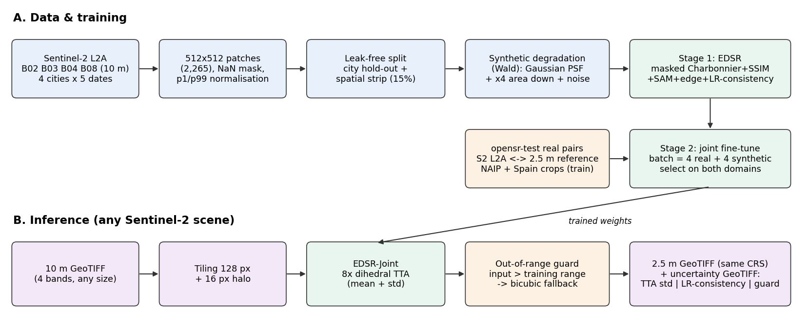
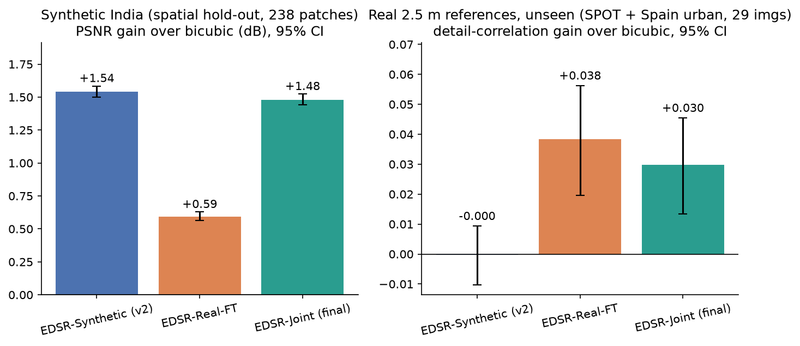
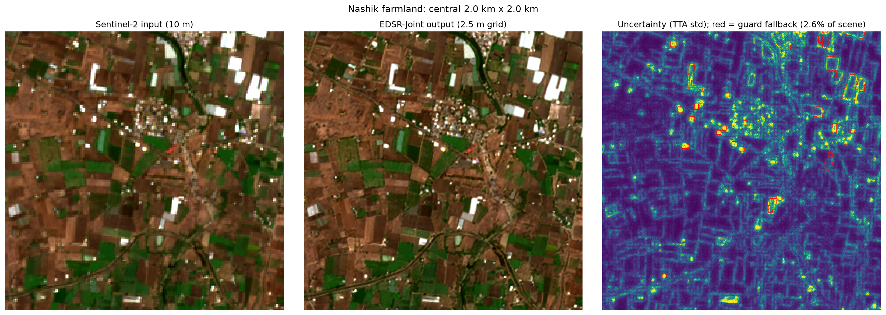
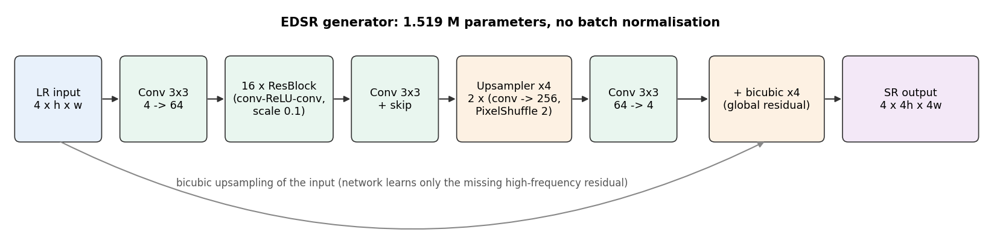
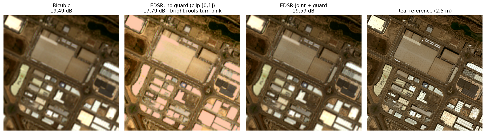

# Super-Resolution Mapping (SRM) for Sentinel-2

**Team PlotSphere · Smart India Hackathon · Problem Statement [PS ID]**

Deep-learning super-resolution of **Sentinel-2 10 m imagery (B02, B03, B04, B08) to a 2.5 m grid (×4)**, with:
- spectral consistency measured explicitly,
- validation on **real 2.5 m reference imagery**,
- a **per-pixel uncertainty map** whose reliability is itself tested.

The output is a georeferenced GeoTIFF in the input's CRS, plus a 3-band uncertainty GeoTIFF.



> **What we claim, precisely.** The output *grid* is 2.5 m. On real 2.5 m references the model adds
> statistically significant real detail, but radiometric PSNR is on par with bicubic, and no 2.5 m
> reference was available over India. Treat the product as an enhanced Sentinel-2 image with an
> uncertainty layer, **not** as a substitute for native 2.5 m imagery.

---

## Key results

| Benchmark | Metric | Bicubic | **EDSR-Joint (final)** |
|---|---|---|---|
| India, spatial hold-out (238 patches, synthetic 40→10 m) | PSNR gain | 0 | **+1.48 dB** [1.44, 1.52], better on 100% of patches |
| | SAM / NDVI MAE | 2.70° / 0.0457 | **2.18° / 0.0357** (−19% / −22%) |
| Real 2.5 m references, never used in training (SPOT + Spain urban, 29 images) | Detail-correlation gain | 0 | **+0.030** [0.013, 0.046], better on 79% of images |
| | PSNR gain | 0 | +0.004 dB [−0.22, +0.20] (tie) |
| | WorldStrat SPOT only (9 images) | 0 | **+0.052** detail, better on **100%** of images |
| Uncertainty vs true error | Spearman ρ | — | 0.43 (India), **0.50 (real)** |
| Runtime | 10 km × 10 km scene → 2.5 m, 8× TTA | — | **95.5 s** on a laptop RTX 3050 (4 GB) |

95% bootstrap confidence intervals are in brackets.

**Generalisation to cities never seen in training** (stage-1 recipe):

| Test city | PSNR gain | Better than bicubic on | SAM / NDVI error vs bicubic |
|---|---|---|---|
| Nashik (semi-arid) | **+1.25 dB** [1.22, 1.28] | 100% | −17% / −19% |
| Guwahati (humid, hilly) | **+0.72 dB** [0.68, 0.75] | 100% | −8% / −9% |

**Why the joint model is the final model:**



| Model | India gain (dB) | Real detail gain | Real SAM |
|---|---|---|---|
| EDSR-Synthetic (stage 1 only) | **+1.54** | −0.000 (none) | 3.60° |
| EDSR-Real-FT (real pairs only) | +0.60 | **+0.038** | **3.17°** |
| **EDSR-Joint (final)** | **+1.48** | **+0.030** | 3.38° |

Each single-domain model wins only in its own domain. The joint model is the only one significantly better than bicubic on both benchmarks: it keeps 96% of the India gain and 79% of the real-detail gain.

---

## Demo: real Sentinel-2 scene, Nashik, 4 June 2026



Field parcels, polyhouses, roads and the river channel are sharpened. The red outlines show where the out-of-range guard handed pixels to bicubic (2.6% of the scene, on bright polyhouse roofs). There is no 2.5 m reference for this scene, so this demo is qualitative only.

---

## Method

**1. Data.** 2,265 Sentinel-2 patches (512 × 512 px, 10 m) from **Ahmedabad, Guwahati, Nashik and New Delhi**, 5 dates per city (Jan 2025 – Jun 2026). Opaque clouds are stored as NaN and masked out of every loss and metric.

**2. Synthetic pairs (Wald protocol).** Each input is the 10 m patch blurred with a Gaussian PSF and area-downsampled ×4.
- Training: σ ∈ [0.6, 1.2] and 0–1% noise.
- Evaluation: fixed σ = 0.9, no noise.

The same degradation code is used everywhere: data loader, loss, uncertainty and inference.

**3. Leak-free splits.** Two schemes: whole-city hold-out, and a 15% spatial strip per city covering all dates. Training patches that overlap the strip are dropped, and zero overlap is verified.

**4. Model.** EDSR with 16 residual blocks, 64 features, PixelShuffle ×4, and **a global bicubic skip**. 1.519 M parameters.



**5. Loss** (all terms masked):

`1.0·Charbonnier + 0.1·(1−SSIM) + 0.05·spectral-angle + 0.05·Sobel-edge + 0.1·LR-consistency`

**6. Two-stage training.**
- **Stage 1:** synthetic Indian pairs. 60 epochs, Adam 2e-4, batch 8, 128 px HR crops.
- **Stage 2:** joint fine-tuning. Each batch has **4 real opensr-test pairs** (NAIP + Spain crops) and **4 synthetic Indian patches**. Adam 5e-5, 30 epochs. The checkpoint is selected on the *sum* of the real and Indian gains.

**7. Inference.**
- Tiled (128 px + 16 px halo) with **8× dihedral TTA**: the mean is the prediction, the std is the uncertainty.
- **Out-of-range guard:** inputs brighter than the training range fall back to bicubic. Without it, bright roofs turned pink:



**What didn't work, and why it's kept here:** an adversarial (GAN) variant produced sharper texture but lost accuracy and spectral fidelity the longer it trained, and it invented parcel outlines. See `docs/figures/fig03_gan_tradeoff.png`.

---

## Repository structure

```
srm_project/
├── configs/
│   ├── edsr_baseline.yaml       # stage 1 (all hyper-parameters)
│   ├── esrgan_finetune.yaml     # GAN ablation
│   └── rcan.yaml                # alternative backbone (not used in the results)
├── srm/                         # library
│   ├── data.py                  # path remap, leak-free split, normalisation, degradation, Dataset
│   ├── models.py                # EDSR, RCAN, PatchGAN discriminator
│   ├── losses.py                # masked Charbonnier / SSIM / SAM / edge / LR-consistency / GAN
│   ├── metrics.py               # PSNR, SSIM, SAM, ERGAS, NDVI-MAE, bootstrap CIs
│   ├── uncertainty.py           # TTA mean/std, consistency map, out-of-range guard
│   ├── trainer.py               # stage-1 / GAN training loop
│   └── config.py
├── scripts/
│   ├── check_data.py            # verify patches, shapes, NaNs, zero split overlap
│   ├── train.py                 # stage 1 or GAN (--stage gan), --dry-run, --set overrides
│   ├── finetune_opensr.py       # stage 2 (real or joint with --mix-synthetic)
│   ├── evaluate.py              # synthetic benchmark + uncertainty calibration
│   ├── eval_opensr.py           # real 2.5 m benchmark (downloads opensr-test)
│   ├── visualize.py             # sample panels, training curves
│   ├── make_s2_stack.py         # Sentinel-2 .SAFE -> 4-band 10 m GeoTIFF (+ crop)
│   ├── infer.py                 # scene -> 2.5 m GeoTIFF + uncertainty GeoTIFF
│   ├── validate_reference.py    # compare an SR GeoTIFF with your own HR reference
│   ├── make_figures.py          # all report figures from saved results
│   ├── collect_evidence.py      # dump every config/metric/log into evidence.md
│   └── data_prep/
│       ├── consolidate_patches.py   # per-scene metadata.csv -> master index
│       └── validate_patches.py      # band count, NaN %, scaling, negative-value checks
├── legacy/                      # first baseline (scene split, 8-block EDSR); superseded by srm/
├── app.py                       # Streamlit live demo (scene SR + live accuracy check)
├── docs/figures/                # figures used in this README
├── master_patch_index.csv       # patch index (city, scene, location, validity)
├── normalization_stats.json     # shared per-band p1/p99 statistics
└── requirements.txt
```

Not in the repository: the patch data (`patches/`, ~9.5 GB), `opensr_data/` (downloaded automatically), Sentinel-2 `.SAFE` products, demo GeoTIFFs, and all but the final checkpoint. See [Data](#data) and [Checkpoint](#checkpoint).

---

## Setup

```bash
conda create -n srm python=3.11 -y
conda activate srm
# GPU: install the CUDA build of PyTorch first (pick the CUDA version your driver supports)
pip install torch torchvision --index-url https://download.pytorch.org/whl/cu124
pip install -r requirements.txt
```

Tested on: Windows, Python 3.11, PyTorch 2.6.0 + CUDA 12.4, NVIDIA RTX 3050 Laptop GPU (4 GB).

## Data

Place the patch folder so that paths look like `patches/<City>/<Scene_k_YYYY-MM-DD>/patch_XXXX.npy`. Each patch is a `(4, 512, 512)` float32 array: B02, B03, B04, B08, raw digital numbers, with NaN for no-data. The index CSV stores absolute paths from the machine that created it, and the code rewrites them automatically to `--set data.data_root=<your patches folder>`.

**How the patches were made.**
1. A Sentinel-2 pre-processing notebook writes, per city and scene, 512 × 512 patches as `(4, H, W)` float32 `.npy` arrays (B02, B03, B04, B08; NaN = no-data) plus a `metadata.csv`. Its columns are `patch_id, city, scene, row_start, col_start, patch_size, valid_percentage`. Source, product level, date/cloud selection, AOIs and cloud masking: [TO FILL by data team].
2. Consolidate all per-scene metadata into one index. This drops entries whose `.npy` is missing and adds a `global_id`:
   ```bash
   python scripts/data_prep/consolidate_patches.py --root patches --out master_patch_index.csv
   ```
3. Quality-check a sample of patches per city. It flags band count ≠ 4, > 15% NaN, max > 20,000 (wrong scaling), double scaling, and negative values:
   ```bash
   python scripts/data_prep/validate_patches.py master_patch_index.csv
   ```

```bash
python scripts/check_data.py --config configs/edsr_baseline.yaml
```

## Training

```bash
# 0. smoke test (tiny model, 2 epochs)
python scripts/train.py --config configs/edsr_baseline.yaml --dry-run

# 1. stage 1 on all cities, clip range [0, 1.5]
python scripts/train.py --config configs/edsr_baseline.yaml \
    --set train.batch_size=8 data.test_city=none "data.clip=[0,1.5]" train.out_dir=runs/edsr_final_v2

# 2. stage 2: joint fine-tuning (real opensr-test pairs + Indian patches)
python scripts/finetune_opensr.py --ckpt runs/edsr_final_v2/best.pt --mix-synthetic 0.5 --out runs/edsr_ft_joint
```

To reproduce the unseen-city results:
```bash
python scripts/train.py --config configs/edsr_baseline.yaml --set train.batch_size=8                       # Nashik held out
python scripts/train.py --config configs/edsr_baseline.yaml --set train.batch_size=8 data.test_city=Guwahati train.out_dir=runs/edsr_guwahati
```

Training resumes automatically from `last.pt`. On Windows, add `--set data.num_workers=0` if the DataLoader fails.

## Live demo app

```bash
pip install streamlit
streamlit run app.py
```
- **Super-resolve a scene:** upload a 4-band GeoTIFF or pick one from `demo/`, select an area, then view output, uncertainty, guard and NDVI and download the GeoTIFFs.
- **Accuracy check:** degrade a held-out patch to 40 m, super-resolve it and score it against the real 10 m patch, live.

## Evaluation

```bash
# synthetic benchmark (held-out city or spatial strip) + uncertainty calibration
python scripts/evaluate.py --ckpt runs/edsr_baseline/best.pt --tta
python scripts/evaluate.py --ckpt runs/edsr_final_v2/best.pt runs/edsr_ft_real/best.pt runs/edsr_ft_joint/best.pt --split val --tta

# real 2.5 m benchmark on datasets never used for training
python scripts/eval_opensr.py --ckpt runs/edsr_ft_joint/best.pt --datasets spot spain_urban --tta --norm-range 0 1.5

# all figures from the saved results
python scripts/make_figures.py
```

**Metric conventions:**
- PSNR and SSIM are computed on normalised values.
- SAM, ERGAS and NDVI error are computed on reflectance after removing the Sentinel-2 L2A +1000 DN offset.
- All metrics are masked, computed per image, and reported with 95% bootstrap CIs and paired gains over bicubic.
- PSNR is **not** comparable between the synthetic and real tables, because they use different normalisations.

## Inference on any Sentinel-2 scene

```bash
# 1. stack B02/B03/B04/B08 from a downloaded L2A .SAFE (optional crop around a point)
python scripts/make_s2_stack.py --safe "S2A_MSIL2A_..." --center 20.05 73.72 --size-km 10 --out demo/scene_10m.tif

# 2. super-resolve
python scripts/infer.py --ckpt runs/edsr_ft_joint/best.pt --input demo/scene_10m.tif --output demo/scene_2p5m.tif --tta
```

`make_s2_stack.py` prints the scene's band means against the training statistics. All four ratios should be near 1. Large deviations mean a different product level or offset.

**Outputs:**

| File | Content |
|---|---|
| `scene_2p5m.tif` | 4 bands (B02, B03, B04, B08), digital numbers, 2.5 m grid, input CRS |
| `scene_2p5m_uncertainty.tif` | band 1 TTA std · band 2 LR-consistency error · band 3 guard mask (1 = bicubic fallback) |

## Checkpoint

Final model: `runs/edsr_ft_joint/best.pt` (EDSR-Joint, 1.519 M parameters, 6.1 MB). Download: [TO FILL: release link]. The checkpoint embeds its configuration, so `evaluate.py`, `eval_opensr.py` and `infer.py` need nothing else.

## Reproducibility

| Item | Value |
|---|---|
| Stage-1 training | 60 epochs, 0.75–1.14 h per run on an RTX 3050 Laptop GPU |
| Stage-2 fine-tuning | 30 epochs |
| Inference | 95.5 s for 10 × 10 km (1000² → 4000² px) with 8× TTA |
| Evidence | `python scripts/collect_evidence.py` writes every config, log and metric to `evidence.md` |

## Limitations

- The **<4 m claim is only partly supported**: real detail gain is significant, PSNR ties bicubic, and there is no Indian 2.5 m reference yet.
- The **final model's Indian results come from a spatial hold-out**. Unseen-city evidence was obtained with the stage-1 recipe.
- **Synthetic Gaussian PSF in stage 1.** Real fine-tuning uses only 90 pairs, from the USA and Spain.
- **Coverage gaps:** thin haze is not masked; only four cities are covered; dense urban cores gain least.
- **Dynamic range:** values above the training range are not super-resolved. The guard falls back to bicubic on about 2–4% of pixels.

## Citation

```bibtex
@misc{plotsphere2026srm,
  title  = {Super-Resolution Mapping of Sentinel-2 Imagery with Validated Uncertainty},
  author = {Team PlotSphere},
  year   = {2026},
  note   = {Smart India Hackathon, Problem Statement [PS ID]},
  url    = {[GitHub URL]}
}
```

Methods and data this work builds on:
- EDSR (Lim et al., CVPRW 2017)
- Wald protocol (Wald et al., PE&RS 1997)
- opensr-test (Aybar et al., IEEE GRSL 2024)
- WorldStrat (Cornebise et al., NeurIPS D&B 2022)
- ESRGAN (Wang et al., ECCVW 2018)

## License and data attribution

- **Code:** [TO FILL: license, e.g. MIT].
- **Sentinel-2:** contains modified Copernicus Sentinel data (2025–2026).
- **Real references:** opensr-test / WorldStrat / NAIP references are used under their respective licences and are not redistributed here.

## Team PlotSphere

[Team members and roles] · [Institute] · Mentor: [Mentor]
